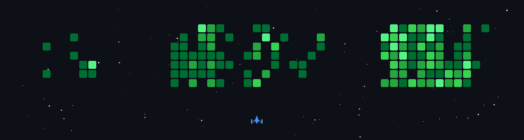

<p align="center">
  <picture>
    <source media="(prefers-color-scheme: dark)" srcset="./assets/dark.svg">
    <source media="(prefers-color-scheme: light)" srcset="./assets/light.svg">
    
  </picture>
</p>

<!-- <h1 align="center">Hi there! 👋 I am Shobhit Kumar </h1>

<p align="center">
  
</p>

---

## 👨‍💻 About Me

```yaml
Name: Shobhit Kumar
Role: Computer Science Engineer & Full-Stack Developer
Education: B.Tech CSE (Specialization in IoT & Blockchain)
Passions: Web Development, Decentralized Tech, IoT Systems, & Competitive Coding
Location: India
Status: 🚀 Open to Opportunities & Collaborations
``` -->

<p align="center">
  <a href="https://kumarshobhit.tech" target="_blank">
    
  </a>
</p>

- 🏫 **Computer Science Student**: Specializing in **Internet of Things (IoT)** and **Blockchain Technology**.
- 💻 **Full-Stack Enthusiast**: Experienced in building responsive web applications using **React, Node.js, Express, MongoDB, and modern CSS**.
- 🧩 **Problem Solver**: Active problem solver on **LeetCode**, **GeeksforGeeks**, and **HackerRank**.
- ⚡ **Always Learning**: Passionate about system design, Web3 technology, and building high-performance web products.

---

### 🚀 Tech Stack & Skills:

<table align="center" width="100%">
  <tr>
    <td width="20%"><b>💻 Languages</b></td>
    <td>
      
      
      
      
      
      
    </td>
  </tr>
  <tr>
    <td width="20%"><b>🎨 Frontend</b></td>
    <td>
      
      
      
      
    </td>
  </tr>
  <tr>
    <td width="20%"><b>⚙️ Backend</b></td>
    <td>
      
      
      
      
    </td>
  </tr>
  <tr>
    <td width="20%"><b>🗄️ Databases & Cloud</b></td>
    <td>
      
      
      
    </td>
  </tr>
  <tr>
    <td width="20%"><b>🧰 Tools & OS</b></td>
    <td>
      
      
      
      
      
    </td>
  </tr>
</table>

---

### 📊 GitHub Stats:

<p align="center">
  <a href="https://github.com/kumarshobhit-1">
    
  </a>
  <a href="https://github.com/kumarshobhit-1">
    
  </a>
  <br><br>
  <a href="https://git.io/streak-stats">
    
  </a>
</p>


<p align="center">
  <a href="https://github.com/kumarshobhit-1">
    
  </a>
</p>

---

## 🏆 GitHub Trophies
<p align="center">
  <a href="https://github.com/kumarshobhit-1">
    
  </a>
</p>


---

## 🧠 Competitive Programming Profiles

<div align="center">
  <a href="https://leetcode.com/kumarshobhit-1" target="_blank">
    
  </a>
  <br/><br/>
  <a href="https://www.geeksforgeeks.org/user/kumarshobhit/" target="_blank">
    
  </a>
  <a href="https://hackerrank.com/shobhitkumar1437" target="_blank">
    
  </a>
</div>

---

## 📈 Contribution  
<p align="center">
  
</p>

---

### 🔝 Top Contributed Repositories

<p align="center">
  <a href="https://github.com/kumarshobhit-1/WanderLust-Major-Project">
    
  </a>
  <a href="https://github.com/kumarshobhit-1/Data-visualisation-with-Python">
    
  </a>
</p>

---

### 💬 Random Dev Quote:


---

### ✨ Contact Me:

[](https://linkedin.com/in/shobhit-kumar1437/)
[](mailto:shobhitkumar1437@gmail.com)

---

### 🖥️ Coding Platforms:

[](https://leetcode.com/kumarshobhit-1/)
[](https://hackerrank.com/shobhitkumar1437)

---

<div align="center">
  <p><i>Made with ❤️ by <b>Shobhit Kumar</b></i></p>
  <p>⭐ Feel free to star repositories you find interesting!</p>
</div>

---


<p align="center">
  
</p>

[](https://visitcount.itsvg.in)
